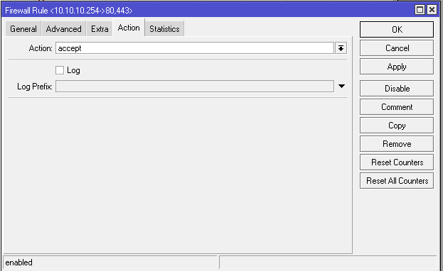
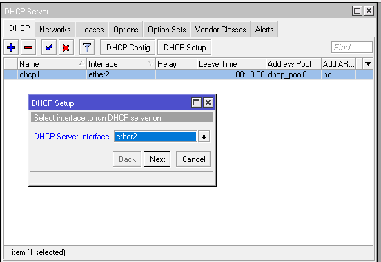

# LAB-49-5-SEPTEMBER-2025

**berikut beberapa video yang bersangkutan dengan Vidio yang akan di buat**
1. https://youtu.be/Eq55upUAJdo?si=VaajGSBBxYcOJz_E
2. https://youtu.be/YoasEqujUhM?si=5AkElW2B6st5PAmq
3. https://youtu.be/_pT4qXrS1PM?si=bxcmnWdRTiFsUtun
4. https://youtu.be/zdEQa6Cc4mI?si=uIyCmNNZrsGxfi1k
5. https://youtu.be/wTnkFQqAZpg?si=o2ed5CZsL-lMp-r5
6. https://youtu.be/-308OOgvROY?si=Z-ph3wqvLy_NDVCO
7. https://youtu.be/vH8iQSsjNgk?si=HHzogQt_9qytkbo7
8. https://youtu.be/QOiwfWnnYG4?si=glBlPIxCMTihsHB9
9. https://youtu.be/0H7sruQJJJ0?si=ceBaCcDrZi6Q3FSI
10. https://youtu.be/gQ7woFTu4zI?si=Knc3ObTIaTeM09VK

# konfigurasi
tentang: Advanced DHCP, Firewall filter, Firewall mangle, Qudue tree, HTB, dan Advanced addresslist.

**1. Firewall filter**   
disini saya akan mlakukan konfigurasi agar client hanya bisa mengakses situs tertentu        

    a. buka winbox    
    b. lakukan konfigurasi dasar hingga terhubung ke internet   
    c. pilih menu ip > firewall 
    d. nah pertama kita akan memasukan website apa saja yang bole di akses ke addresslist di tab addresslist

    e. lalu pilih tab firewall filter untuk melakukan blokir website yang tidak termasuk ke dftar addresslist dan memasukan addreslist website yang bole di akses tadi ke dst addresslist di tab advanced. disini web menggunakan protocol tcp dan port http 80 serta https 443

chain *forward=paket data yang melewati router*    
action *accept=di perbolehkan*

action *drop=di bloklangsung*

    f. pengujian, di sini saya akan mencoba membuka tik tok

*ternyata tidak bisa karena tiktok termasuk ke web yang tidak di izin kan dan akhirnya di drop/blokir di firewall filter*

    g. dan saya akan mencoba mengakses web web yang di perbolehkan tadi apa kah bisa atau malah tidak bisa? mari kita lihat

*ternyata bisa berarti konfigurasi yang telah kita lakukan tadi berhasil*

**2. Advanced DHCP**    
di sini saya akan melakukan konfigurasi agar client dapat mengakses internet dan memiliki ip address secara dynamic dari server.  

    a. sambungkan mikrotik ke laptop lalu colokkan kabel isp ke mikrotik atau bisa juga konekkan hospot ke mikrotik. 
    b. masuk winbox
    c. pilih menu ip > DHCP Client
    d. klik (+) dibagian interfaces saya di sini internet nya menggunakan hospot maka saya memilih wlan1 klik apply dan ok. lihat hingga ip address wlan1 ini muncul agar bisa tau konek atau tidak klo sudah muncul berarti sudah konek.

    
    e. lalu pilih menu ip > address untuk menambahkan ip address untuk client
    f. klik (+) masukan ip address, interface nya pilih interface yang kabelnya menuju client/pc. di sini saya menggunakan interface ether2
    
     
    
    g. lalu pilih ip > firewall > nat, untuk mengubah ip private menjadi ip public dengan menggunakan action masquerade dengan out-interface yaitu wlan1 karena dari beliau lah sumber internetnya.
    
     

    h. lalu tambahkan dns 8.8.8.8 di menu ip > dns 
    

 
    i. terakhir pilih menu ip > DHCP server > DHCP setup untuk memberikan ip address secara otomatis kepada client

*next next hingga selesai*

    j. cek dan pengujian 

bisa dilihat sekarang client sudah mendapatkan ip   

dan sudah bisa mengakses ke internet

    k. Static Lease – Kunci IP untuk laptop
       pilih menu ip > dhcp server > lease 
       tambahkan mac address laptop dan ip laptop

    
Simple Bandwidth Control for 1 User in MikroTik
